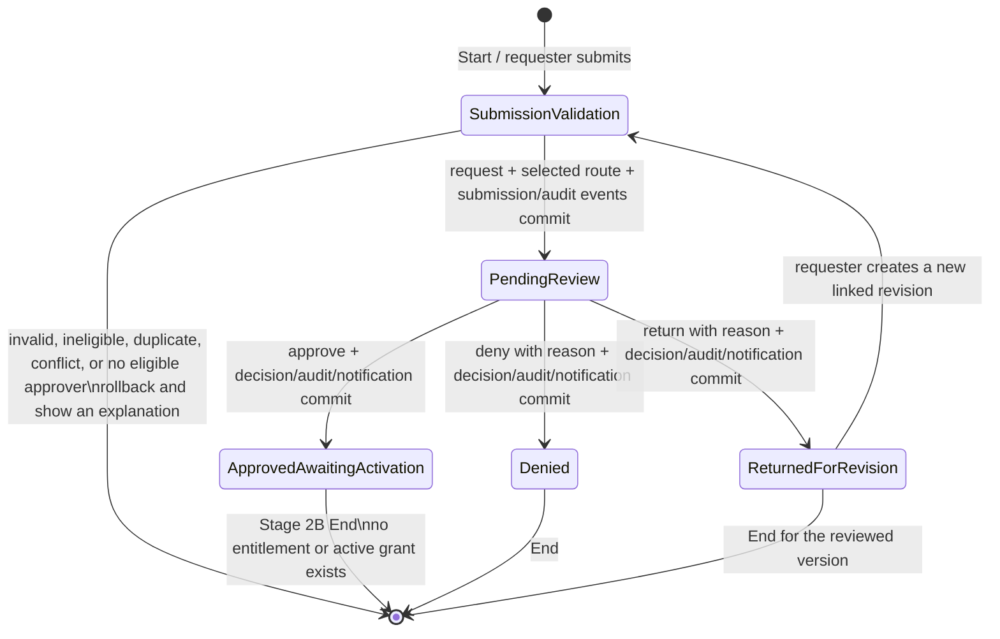

# Permora Stage 2B plan: administrator approval workflow

Updated 2026-09-20. This document records the Stage 2B design and implementation milestones. Stage 2A authentication and database-backed rate limiting remain in force.

> **Milestone 3 implemented — 2026-09-20:** `POST /api/review/requests/:id/decision` now exposes approve, deny, and return-for-revision through a server-authorized transaction. The route requires an active Better Auth session, approver/admin role, a current responsibility, same-origin JSON, a UUID `Idempotency-Key`, a positive `expectedVersion`, and an allowed decision. The transaction remains restricted to the persisted fully eligible assignee, serializes each actor/key pair, returns an existing result only for an identical replay, and rejects stale, duplicate, mismatched, or terminal commands. Approval revalidates the active requester and role, resource and permission availability, current policy duration, scope options and assignments, own-account constraints, ordinary entitlements, and overlapping approved requests. Denial and return require a non-empty public reason.
>
> Migration `0006_stage_2b_decision_operations.sql` adds durable decision idempotency keys and recipient-scoped `user_notification` records. Decision, state/version update, assignment completion, immutable request event, immutable audit event, and requester notification commit together. Approval ends at `approved_pending_activation`; it creates no entitlement, active grant, activation event, or downstream provisioning. The endpoint accepts no actor, role, requester, assignee, scope, status, entitlement, or activation authority from the browser. The final staff UI and requester notification UI remain deferred.
>
> **Milestone 2 implemented — 2026-09-20:** server-side `requireAdmin()` and `requireApprover()` guards now derive active identity, roles, and current approval responsibility from the Better Auth session and PostgreSQL. The read model exposes an assignment- and full-scope-responsibility-scoped queue and detail query, plus a separate administrator-only query for preserved unassigned routing failures. Explicit DTOs, validated filters, bounded pagination, deterministic ordering, enumeration-resistant detail lookup, generic service errors, and private/no-store responses are covered by isolated PostgreSQL and route-authorization tests. Administrators have no global review bypass: the normal queue/detail still requires the persisted assignment and a current responsibility. No decision mutation, activation behavior, or final administrator UI was added. No schema change was required beyond migrations `0004` and `0005`.
>
> Read endpoints: `GET /api/review/requests`, `GET /api/review/requests/:id`, and `GET /api/admin/unassigned-requests`. Queue DTOs contain request/display IDs, requester display identity and requester role, resource and permission labels, requested validity (assigned queue), submission/assignment times, state, and decision version. Detail DTOs additionally contain requester email/department, resource sensitivity, validated scope display values, purpose, timeline, and immutable decision summary. Passwords, credentials, sessions, auth account IDs, responsibility IDs, policy IDs, raw database metadata, and unrelated personal data are excluded.
>
> **Milestone 1 implemented — 2026-09-20:** migration `0004_stage_2b_approval_foundation.sql` adds approval states, versions, full-scope responsibility mappings, one persisted review assignment, immutable decisions/events, and supporting constraints/indexes. Migration `0005_enforce_approval_decision_reason.sql` applies the final non-empty denial/return reason constraint consistently to already-migrated databases. New submissions are routed transactionally by current open-assignment count and stable approver UUID. Records with no fully eligible candidate remain `pending_routing` and cannot be decided. The server-side decision domain supports approve, deny, and return-for-revision with optimistic concurrency and atomic audit creation, but no admin route or control exposes those operations yet.
>
> Existing Stage 2A `pending` records are preserved as `pending_routing`. Inspect them with `npm run approvals:reconcile -- --database test` or, for development, `npm run approvals:reconcile -- --database development --confirm-database-name <development-database-name>`. Both are dry runs unless `--apply` is supplied. Test targets must end in `_test`; development requires exact database-name confirmation and apparent production targets are rejected. The command never prints a connection string.

The repository evidence below is marked **Observed**. Workflow choices that are needed to make the feature safe and testable are marked **Proposed**. Open institutional policy choices are marked **Unresolved**.

## 1. Current admin-side implementation audit

### Runtime and service coverage

| Area | Current state | Evidence and Stage 2B gap |
| --- | --- | --- |
| Authentication | **Implemented** | Better Auth 1.7 email/password, Argon2id, revocable PostgreSQL sessions, origin/CSRF checks, and database rate limiting are active. `getTrustedIdentity()` loads active status and roles from PostgreSQL. These controls must remain unchanged. |
| Portal guard | **Partial** | `app/(portal)/layout.tsx` requires an authenticated identity, but it does not authorize an administrator or approver role. Every admin page therefore needs its own server-side role guard; hiding a navigation item is insufficient. |
| Staff navigation | **Placeholder** | `components/app-shell.tsx` shows only “Stage 2A status” for accounts without a requester role. It has no review queue or audit navigation. |
| Staff dashboard | **Placeholder** | `components/server-dashboard.tsx` confirms the account/session and explicitly says workflow is deferred. It does not query admin metrics. |
| `/review` | **Missing workflow** | The page renders `DeferredFeature`. There is no assigned queue, staff-scoped detail read, or decision action. |
| `/audit` | **Missing workflow** | The page renders `DeferredFeature`. `audit_event` exists, but no protected audit query or export service exists. |
| `/permissions`, `/users`, `/resources`, `/reports`, `/notifications` | **Missing workflow** | Each page renders `DeferredFeature`. Full administration and activation remain outside this approval milestone, except for a requester-visible in-app decision notification if added with the decision transaction. |
| Request submission | **Implemented with a routing precheck** | `createAccessRequest()` validates the requester, policy, assignments, dates, duplicates, entitlements, and the existence of at least one active responsibility. It then inserts a `pending` request, submission history, and audit event in one transaction. It does **not** select or persist an approver. |
| Requester reads | **Implemented and owner-scoped** | List, filters, counts, and detail reads include `requester_user_id`. `requireRequester()` derives the requester identity from the session. |
| Approval service | **Missing** | There is no server query for an approver queue, no decision service, no optimistic version, and no database decision record. |
| Approval persistence | **Missing** | `access_request.status` supports only `pending`, `denied`, `expired`, and `cancelled`. `request_submission_history` supports only submission events. There is no assignment, decision, revision, notification, activation queue, or concurrency record. |
| Audit immutability | **Partial** | `audit_event` is append-oriented by convention, but the schema does not prevent update/delete by the runtime database role. |
| Tests | **Stage 2A only** | PostgreSQL integration tests cover auth, rate limiting, owner isolation, forged requester fields, eligibility failure, and persistence. Old `demo-service` and browser workflow tests exercise local prototype approval behavior and are not evidence of server authorization or transactional approval. |

### Figma coverage

The Figma file was inventoried again and the relevant screens were inspected through rendered screenshots and design context, rather than layer names alone.

- **Observed — `7:5`, Admin Dashboard:** dark 288px desktop sidebar, yellow selected navigation, summary cards, recent requests, system status, and quick actions. Its institutional labels and sample figures are presentation examples only.
- **Observed — `7:447`, Access Requests List:** staff queue with search, status and date filters, a new-today count, requester/resource/access/status columns, pagination, export, and View Details actions.
- **Observed — `3:1257`, Admin: Review Request:** requester profile, resource, access level, purpose, requested start/duration, calculated expiration, a review comment, approve and deny controls, and a security-audit checklist.
- **Observed — `3:2061`, Admin: History / Audit Log:** search and filters, export/print controls, and event rows for request, approval, grant, download, and expiration events.
- **Observed limitation:** all relevant frames are 1440px desktop designs. There is no verified mobile admin layout.
- **Observed limitation:** Figma does not show return-for-revision, confirmation dialogs, validation errors, routing failure, stale decisions, concurrent reviewers, empty states, or access activation waiting states. These must be implemented as accessible proposed states, not described as Figma-verified behavior.
- **Required adaptation:** use Permora branding and the existing design tokens. Figma’s TIP/university identity and claims such as automatic institutional verification must not appear.

## 2. Proposed admin routes and components

Routes should use Server Components for protected reads. Client Components are limited to interactive filters, dialogs, and form pending state. Server Actions must repeat authorization and must never accept an actor ID or role from the browser.

| Route | Access | Purpose | Main components |
| --- | --- | --- | --- |
| `/dashboard` | Authenticated `approver` or `admin`; metrics responsibility-scoped | Staff overview with assigned pending count and recent decisions | `StaffDashboard`, `ApprovalSummaryCards`, `AssignedRequestPreview` |
| `/review` | Authenticated active `approver` or `admin` with at least one current responsibility | Assigned review queue, search, status/resource/date filters, and pagination | `ApprovalQueue`, `ApprovalFilters`, `ApprovalTable`, `QueueEmptyState` |
| `/review/[id]` | Same role plus a current responsibility matching the persisted assignment | Read a review snapshot and submit one decision | `ReviewRequestDetails`, `RequesterSummary`, `RequestedAccessSummary`, `PolicyChecks`, `DecisionPanel`, `DecisionDialog`, `RequestTimeline` |
| `/requests/[id]` | Request owner only | Show the decision, reason, and approval-pending-activation state to the requester | Extend `ServerRequestDetails`; do not share the staff query |
| `/notifications` | Authenticated recipient only | Show persisted in-app decision notifications | `NotificationList`, `NotificationItem`; preferences and external delivery remain deferred |
| `/audit` | `admin` role only | Search approval-related immutable events | `AuditFilters`, `AuditTable`, `AuditEventDetails`; export is deferred until authorization and retention rules are approved |
| `/permissions` | `admin` role only | Future activation queue | Keep unavailable during Stage 2B unless a read-only approved-awaiting-activation list is included; no activate button in this stage |

**Proposed component boundary:** `ApprovalQueue` and review detail receive sanitized DTOs. `DecisionPanel` sends only `requestId`, `expectedVersion`, `decision`, and `reason`. The server derives the actor, assignment, responsibility, prior state, requester, and policy from PostgreSQL.

**Proposed responsive behavior:** retain the existing mobile drawer; render queue rows as labeled cards below the table breakpoint; keep filters in a collapsible fieldset; stack review details above the decision panel; use at least 44px touch targets. This is a recommendation because Figma has no mobile admin frames.

## 3. Approval state machine, including Start and End states

**Proposed canonical states:** `pending_review`, `approved_pending_activation`, `denied`, `returned_for_revision`, `cancelled`, and `expired`. “Approved” must not mean active. `expired` applies to an activated entitlement in a later stage, or to legacy data; Stage 2B does not fabricate it from an approved request.

An approval version has exactly one terminal decision. A returned request remains an immutable reviewed version. “Revise and resubmit” opens a new request prefilled from the prior record, links it with `revision_of`, and repeats all current eligibility, conflict, policy, availability, and routing checks. Locked client fields never bypass validation.

Existing Stage 2A `pending` rows have no persisted route. **Proposed migration rule:** quarantine them as `pending_routing`, select an eligible approver under current policy in a controlled reconciliation transaction, and move only successfully assigned rows to `pending_review`. Unroutable legacy rows remain visible to administrators as blocked and cannot be decided. New submissions fail closed and commit no request when routing fails.

## 4. Authorization rules

1. Every staff route and mutation starts from the Better Auth session and active `user_profile`; anonymous or inactive users are rejected before data access.
2. `/review` requires a server-trusted `approver` or `admin` role. An administrator receives no global decision bypass: the administrator must also hold a current `approver_responsibility` matching the request.
3. `/audit`, responsibility administration, user administration, and policy administration require a server-trusted `admin` role. These route checks are separate from approval responsibility.
4. A decision is authorized against the persisted active review assignment and its referenced responsibility. Resource, permission, scopes, validity, actor, and request status are loaded inside the decision transaction.
5. Browser values for actor ID, requester ID, role, status, resource, scope, selected approver, policy version, or responsibility ID are ignored or rejected.
6. Self-approval is prohibited in the initial implementation. The existing submission check already excludes the requester when testing route existence; persisted routing and decision authorization must enforce the same rule.
7. Requesters can read only their own requests, events, and notifications. Staff may read only assigned requests unless a separate audited admin oversight permission is approved later.
8. Denial and return-for-revision require a trimmed reason. **Proposed validation:** 10–2,000 characters. Approval comments are optional, but any supplied comment uses the same maximum and is visible to the requester unless explicitly marked internal in a future schema.
9. Approval revalidates current requester activity, role/assignment eligibility, resource availability, permission/policy compatibility, dates, duplicate conflicts, and responsibility. Denial or return still requires a live assignment and pending state but does not need eligibility to remain valid.
10. Authorization failure returns a generic forbidden/not-found response appropriate to the route and does not reveal another requester’s record.

## 5. Approver routing rules

**Observed:** `approver_responsibility` can constrain a user by resource, optional permission, and one optional scope option. Submission currently checks only that any matching active responsibility exists; it does not persist which candidate was selected.

**Proposed initial routing:**

1. Build candidates inside the submission transaction from active profiles with an `approver` or `admin` role and a responsibility valid at submission time.
2. Require exact resource match. An optional permission constraint must equal the requested permission. Every scope constraint recorded for a responsibility must be present on the request; a match on one of several request scopes is insufficient.
3. Exclude the requester and any suspended/inactive candidate.
4. Prefer the most specific responsibility: permission plus scope, then permission, then scoped resource, then resource-wide. Among equally specific candidates, select the candidate with the fewest active assigned reviews, then use responsibility creation time and UUID as stable tie-breakers.
5. Persist the selected approver and responsibility. The queue is assignment-based, not role-wide.
6. If no candidate exists, roll back submission and show: “No eligible approver is configured for this request. Contact an administrator.” Do not leave an unassigned new request.
7. Reassignment is an explicit administrator operation added after the core decision path. It must select another eligible candidate, supersede the old assignment, and append audit events in one transaction. Silent rerouting is forbidden.
8. Responsibility expiry after assignment blocks approval until an authorized reassignment occurs. Historical assignment and responsibility identifiers remain recorded.

Multi-stage or unanimous approval is not part of the first Stage 2B workflow. The schema should preserve room for ordered stages without presenting that behavior now.

## 6. Database changes required

Add one new versioned, forward-only migration in the implementation milestone; do not edit migrations `0001`–`0003`.

- Extend the `access_request` status constraint for `pending_routing`, `pending_review`, `approved_pending_activation`, and `returned_for_revision`; map existing `pending` records through the controlled reconciliation described above.
- Add `version integer NOT NULL DEFAULT 1 CHECK (version > 0)` to `access_request` for compare-and-swap decisions, plus `revision_of uuid REFERENCES access_request(id)` distinct from `renewal_of`.
- Add `request_review_assignment`: request, approver, responsibility, assignment status, assigned/superseded/completed timestamps, and assigning actor. Enforce one active assignment per request with a partial unique index.
- Add a responsibility-scope junction table so a responsibility can constrain all relevant fields, particularly laboratory plus software. Preserve the existing single `scope_option_id` during migration, then stop using ambiguous “matches any request scope” logic.
- Add `request_decision`: request, assignment, actor, action (`approve`, `deny`, `return_for_revision`), public reason/comment, request version, and decision timestamp. Enforce one decision for each request version.
- Replace or complement `request_submission_history` with a generalized append-only `request_event` that supports submitted, routed, reviewed, approved, denied, returned, revision-submitted, reassigned, activation-requested, activated, activation-failed, expired, cancelled, and revoked. Stage 2B writes only events it actually performs.
- Add `user_notification`: recipient, request, event, title/body, created/read timestamps, with recipient-scoped indexes. External email/push delivery is deferred.
- Keep `audit_event` as the security audit stream and add correlation ID, previous/new state, assignment/responsibility references, and policy version either as columns or a versioned metadata contract.
- Enforce append-only decision, request-event, and audit records with database triggers that reject `UPDATE` and `DELETE` for the application role. Document the separate controlled migration/retention path.
- Add indexes for active assignee queue queries, request status/submission time, recipient notifications, and audit filtering.
- Do not insert `ordinary_entitlement`, an access grant, or an activation event when a request is approved.

Migration fixtures must use the isolated database whose parsed name ends in `_test`. No Stage 2B test or migration command may fall back to `DATABASE_URL` or `DATABASE_MIGRATION_URL` when running integration fixtures.

## 7. Transaction and concurrency strategy

Submission should continue using the existing requester/resource advisory transaction lock, but routing selection and `request_review_assignment` insertion must join the same transaction as the request, scopes, submission event, and audit event.

A decision transaction should:

1. Begin and lock the request row with `SELECT … FOR UPDATE`.
2. Compare the submitted `expectedVersion` with the locked `access_request.version`.
3. Require `pending_review`, one active assignment, the session user as assignee, and a still-valid matching responsibility.
4. Revalidate approval-only eligibility and conflicts from canonical database records.
5. Insert the immutable decision, update request status and increment its version, complete the assignment, append request and audit events, and insert the requester notification.
6. Commit all effects together. Any failure rolls back all effects, including the notification.

The unique decision constraint and row lock make simultaneous clicks deterministic: one transaction commits and later contenders receive a `409`-equivalent stale-decision result with instructions to reload. Server Actions should use idempotency keys for network retries and return the already-recorded outcome only when the key and actor match. Deadlock or serialization retries should be bounded and must never replay a different decision.

## 8. Audit-event requirements

Each security-relevant mutation records an immutable event in the same transaction as the domain change. Required fields are event ID, occurred-at timestamp from PostgreSQL, correlation/idempotency ID, session-derived actor, requester subject, request ID/display ID, event type, previous state, new state, policy version, assignment and responsibility IDs, and a minimal metadata snapshot of resource/permission/scope labels.

Required Stage 2B event types are `request_submitted`, `request_routed`, `request_routing_blocked` for legacy reconciliation, `review_approved`, `review_denied`, `review_returned_for_revision`, `review_reassigned`, and `revision_submitted`. Authentication events remain owned by the authentication boundary. Views/searches need access logging only if institutional audit policy requires it; this is unresolved.

Reasons visible to requesters belong in the decision/event record. Logs must exclude passwords, password hashes, session tokens, cookies, `AUTH_SECRET`, database URLs, and unnecessary personal data. Audit exports remain unavailable until export authorization, redaction, retention, and monitoring rules are approved.

## 9. Requester-visible status behavior

| Stored state | Requester label | Behavior |
| --- | --- | --- |
| `pending_routing` | Pending configuration | Legacy request is preserved but cannot be reviewed until an administrator configures and records a route. |
| `pending_review` | Pending review | Shows submission and routing timeline entries derived from persisted records. Do not expose private approver details unless policy permits it. |
| `approved_pending_activation` | Approved — awaiting activation | Shows the approval timestamp and public comment. It explicitly says access is not active yet. Requested future expiration is shown as scheduled, never as a completed event. |
| `denied` | Denied | Shows the required reason and decision timestamp. A new request is allowed only if current policy and duplicate/conflict rules permit it. |
| `returned_for_revision` | Revision requested | Shows the required reason and a “Revise and resubmit” link that opens a new linked request flow. It does not reopen or mutate the decided version. |
| `cancelled` | Cancelled | Read-only terminal history. Cancellation behavior is outside the first approval milestone. |

Counts, filters, table badges, detail timeline, and notifications must all derive from the same database states and events. The application must never show “active,” “access granted,” or a successful activation notification solely because an approver chose Approve.

## 10. Test strategy

### Unit and service tests

- Exhaustively test allowed and rejected state transitions, reason validation, status labels, and requester timeline mapping.
- Test routing specificity, all-scope matching, stable tie-breaking, exclusion of the requester, expired responsibility, inactive approver, missing configuration, and multiple roles.
- Test that decision input parsing drops actor, role, status, requester, assignee, scope, entitlement, and activation fields supplied by the client.

### Isolated PostgreSQL integration tests

- Apply all versioned migrations to `TEST_DATABASE_URL` through the existing guarded runner and seed explicit users, policies, assignments, responsibilities, and requests.
- Verify an approver and an administrator can see and decide only requests assigned through their current responsibilities.
- Verify an administrator role without a matching responsibility cannot read or decide the request.
- Verify requester A cannot read requester B’s request or notifications, and staff cannot use a changed ID to escape assignment scope.
- Verify no route causes a full submission rollback; no request, assignment, history, or audit row remains.
- Verify approve, deny, and return each update the request and append decision, event, audit, and notification records atomically.
- Verify denial and return reject blank/short reasons; approval leaves entitlements and activation records unchanged.
- Race two different decisions with the same version and assert exactly one commits. Repeat a committed idempotency key and assert no duplicate event or notification.
- Force an event/audit insert failure and assert the decision/status update rolls back.
- Verify eligibility, resource availability, policy, conflicts, assignment, and responsibility are rechecked at approval time.
- Verify a returned request creates no mutable reopening; resubmission creates a linked, newly routed request after full validation.
- Verify append-only tables reject application-role update/delete.

### Route and browser tests

- Test anonymous, requester, inactive, approver, and administrator access to every staff route.
- Verify queue search/filters/pagination, empty/loading/error states, detail navigation, confirmation dialogs, focus return, reason errors, stale-decision recovery, and duplicate-click protection.
- Verify requester status/timeline/notification after each decision and confirm approval never displays active access.
- Verify desktop against Figma frames `7:447` and `3:1257`; verify the proposed mobile card/stack layout at narrow widths and keyboard-only operation.

Old demo-service tests may remain as historical prototype coverage, but Stage 2B acceptance must use the real server services and isolated PostgreSQL fixtures.

## 11. Ordered implementation milestones

1. **Completed — Approval domain and database foundation:** add the versioned schema migration, typed state machine, persisted single-approver routing, legacy pending reconciliation, and focused isolated PostgreSQL tests.
2. **Completed — Server authorization and read model:** add `requireAdmin`/`requireApprover`, responsibility-scoped queue/detail queries, DTOs, pagination, and route-access tests.
3. **Completed — Transactional decisions:** implement approve, deny, and return services/actions with optimistic concurrency, idempotency, revalidation, immutable events, notification insertion, and rollback/race tests.
4. **Staff UI:** implement the Figma-aligned queue and review detail with accessible confirmations, validation, stale-state feedback, and proposed mobile behavior.
5. **Requester feedback:** update counts, badges, details, timelines, revision entry point, and recipient-scoped notifications for the new states.
6. **Audit visibility and hardening:** implement the protected approval audit view, verify append-only enforcement, run full lint/type/build/unit/integration/browser checks, and document operations. Keep export disabled until its policy is approved.

## 12. Risks, assumptions, and unresolved policy decisions

### Decisions required before milestone 1

- Confirm the initial workflow uses one selected approver rather than pooled, sequential, unanimous, or resource-specific multi-stage approval.
- Confirm self-approval is prohibited for every resource, including administrators.
- Approve the routing tie-breaker and whether staff may see the individual assignee’s identity.
- Confirm an administrator has no approval override unless granted an explicit matching responsibility.
- Confirm return-for-revision creates a new linked request version and leaves the reviewed record immutable.
- Approve public reason/comment rules, including the proposed 10-character minimum, 2,000-character maximum, and visibility to the requester.
- Define how responsibility scopes combine for resources with multiple fields. This plan requires all configured constraints to match.
- Decide how existing unassigned `pending` rows are handled operationally. This plan quarantines and reconciles them; it never silently treats them as approved or reviewable.

### Decisions that can wait until activation or broader administration

- Which downstream owner provisions each approved resource and whether activation is automatic or manually attested.
- Activation failure, retry, revocation, and expiry worker behavior; entitlement evidence; reconciliation with institutional systems.
- Multi-stage Faculty Grading or sensitive-research approval, delegation, escalation deadlines, out-of-office handling, and reassignment service levels.
- Whether approvers may shorten requested validity, and any second review required for high-sensitivity or high-privilege permissions.
- Audit retention, legal hold, export/redaction permissions, view-access logging, and external security monitoring.
- Email/push notification providers and delivery retry policy. In-app PostgreSQL notifications are sufficient for Stage 2B status visibility.
- Whether Student Portal exceptions belong in Permora or in a separate account-recovery/help-desk process.
- Canonical institutional sources for enrollment, teaching assignments, project membership, lab prerequisites, license capacity, and ordinary access. Administrator-maintained records remain authoritative until integrations exist.

### Material risks and assumptions

- The current responsibility model cannot safely express every multi-field scope; using its present “any matching scope” query for decisions would over-authorize staff.
- The runtime database role currently has broad DML grants. Audit immutability requires database enforcement plus an operational retention path.
- Current Stage 2A submissions prove that a route existed at submission time but do not prove which person was selected. Historical records need explicit reconciliation before review.
- Figma’s security checklist is visual content, not proof that institutional, conflict, or capacity checks occurred. Each displayed check must map to a completed server validation or be omitted.
- Approval is a decision only. Stage 2B ends at `approved_pending_activation`; no entitlement or downstream access may be inferred from that state.

The recommended next milestone is **Staff UI**: implement the protected review queue and request review page against the Milestone 2 reads and Milestone 3 decision endpoint. Include explicit confirmations, denial/return reason validation, one idempotency key per user action, duplicate-submit prevention, stale-version recovery, keyboard and focus behavior, and the proposed responsive card layout. Keep activation and downstream provisioning deferred.
