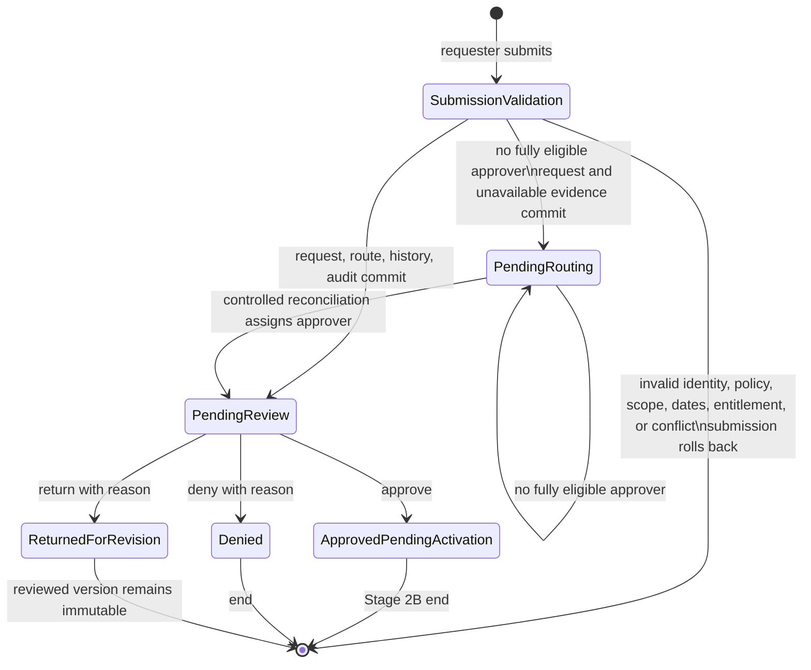

# Permora Stage 2B plan: approval workflow

Updated 2026-09-28. Milestones 1–5 are implemented. This document records the implemented approval design, evidence, deferred boundaries, and next milestone; it is not a claim that downstream access is active.

## 1. Current administrator and approver implementation audit

| Area | Status | Implemented evidence |
| --- | --- | --- |
| Authentication and admission | **Completed** | Better Auth email/password, Argon2id, revocable PostgreSQL sessions, active-profile admission, origin/CSRF checks, and database rate limiting. |
| Server role guards | **Completed** | `requireAdmin()` and `requireApprover()` load identity, active state, roles, and responsibilities from the server session/database. |
| Staff dashboard | **Completed** | `/dashboard` shows responsibility-scoped counts/recent assignments; administrators also see unassigned-routing count. |
| Assigned review queue | **Completed** | `/review` supports validated search/status/resource/date filters, bounded pagination, deterministic ordering, empty/loading/error states, and terminal history. |
| Review details and decisions | **Completed** | `/review/[id]` exposes sanitized details/history and accessible approve, deny, and return dialogs backed by the transactional decision endpoint. |
| Unassigned routing failures | **Completed, read-only** | `/admin/unassigned` and `GET /api/admin/unassigned-requests` are administrator-only; unassigned requests cannot be decided. |
| Requester decision visibility | **Completed** | Owner-scoped request list/detail/count/timeline expose persisted results and requested validity. |
| Requester notifications | **Completed, in-app only** | `/notifications` and its APIs support owner-scoped All/Unread reads and read-state mutations. No external delivery exists. |
| Administrator audit history | **Completed, read-only** | `/audit` and `GET /api/admin/audit-events` provide sanitized filters/pagination; update/delete/export are unavailable. |
| User/resource/policy administration | **Planned** | `/users` and `/resources` are guarded deferred pages. Current maintenance uses controlled CLI/migrations. |
| Activation and entitlement operations | **Planned** | `/permissions` is deferred. Approval creates no entitlement, provisioning job, or active access. |
| Reports/analytics | **Planned** | `/reports` is a guarded deferred page. |
| Revision resubmission | **Planned** | Return is persisted as a terminal decision, but a linked revise-and-resubmit UI is not implemented. |

Historical Figma frames `7:5`, `7:447`, `3:1257`, `3:2061`, and `7:1998` supplied desktop visual language. They do not prove mobile behavior, real security checks, external delivery, or activation. Implemented mobile layouts, dialogs, error states, and keyboard behavior are proposed accessibility adaptations.

## 2. Administrator routes and components

| Route/API | Server access | Current purpose |
| --- | --- | --- |
| `/dashboard` | Active identity; staff data additionally responsibility/admin scoped | Staff workload summary and recent assigned reviews. |
| `/review` | Active approver/admin with a current responsibility | Assigned review queue. |
| `/review/[id]` | Same role plus persisted assignment and full current responsibility coverage | Sanitized detail and decisions while `pending_review`; terminal records remain read-only. |
| `GET /api/review/requests` | Same as queue | Private/no-store queue DTOs. |
| `GET /api/review/requests/[id]` | Same as detail | Private/no-store enumeration-resistant detail DTO. |
| `POST /api/review/requests/[id]/decision` | Persisted assignee with current full coverage | Transactional approve, deny, or return. |
| `/admin/unassigned` | Active administrator | Read-only routing failures. |
| `GET /api/admin/unassigned-requests` | Active administrator | Private/no-store unassigned DTOs. |
| `/audit` | Active administrator | Sanitized immutable event history. |
| `GET /api/admin/audit-events` | Active administrator | Private/no-store audit DTOs. |
| `/notifications` | Active student/faculty requester | Owner-scoped in-app notification center. |
| `GET/POST /api/notifications/*` | Active requester; mutations also same-origin JSON | Notification reads and idempotent read-state changes. |
| `/users`, `/resources`, `/permissions`, `/reports` | Active administrator | Explicit deferred feature pages with no simulated success. |

Implemented component boundaries include `StaffDashboard`, `StaffReviewQueue`, `StaffReviewDetail`, `ReviewDecisionPanel`, `RequesterNotifications`, and `AdministratorAuditLog`. Server Components load protected data; Client Components handle disclosures, filters, dialogs, pending state, and read-state mutations. DTOs exclude credentials, sessions, password data, raw audit metadata, internal policy/responsibility identifiers not needed by the client, and unrelated personal information.

## 3. Approval state machine, including Start and End states

Canonical stored states are `pending_routing`, `pending_review`, `approved_pending_activation`, `denied`, `returned_for_revision`, `cancelled`, and `expired`. The current application does not transition an approved request to active or expired. `expired` is retained for historical/renewal compatibility until activation lifecycle policy is implemented.

A returned request is not reopened. Future revision work must create a new `revision_of` request and repeat current validation/routing. Renewals similarly create a new `renewal_of` request and never reactivate an old record.

## 4. Authorization rules

1. Every protected operation begins with the Better Auth session and active PostgreSQL profile.
2. Requester reads/mutations derive the owner from the session and always scope by requester user ID.
3. Review access requires an approver/admin role, a current responsibility covering the resource, permission, and every requested scope, and the persisted assignment to that user.
4. Administrator role grants administrator routes only. It does not grant a global review or decision bypass.
5. Self-approval and partial responsibility matches are prohibited.
6. Browser-supplied actor, requester, role, status, scope, assignee, responsibility, policy, entitlement, or activation authority is ignored or rejected.
7. Denial and return require a trimmed non-empty reason. Approval may omit a comment.
8. Approval revalidates requester activity/role/assignments, resource/permission/policy, dates, scopes, ordinary entitlements, and overlapping approved requests.
9. Unauthorized and nonexistent detail IDs use equivalent responses where revealing existence would permit enumeration.
10. Notification reads and mutations are recipient scoped. Audit reads are administrator-only and return sanitized summaries.

## 5. Approver routing rules

The initial release uses exactly one persisted approver assignment.

1. Load active approver/admin candidates with a current responsibility for the exact resource.
2. Apply any permission constraint and require responsibility coverage for every requested scope.
3. Exclude the requester.
4. Select the candidate with the fewest open assignments.
5. Use stable approver UUID ordering as the tie-breaker.
6. Persist the selected assignment and route event in the submission transaction.
7. Preserve every unrouteable request as `pending_routing`; it remains visible to administrators and cannot be decided.
8. Reconciliation is dry-run by default and changes data only with explicit `--apply`.

Delegation, reassignment, escalation, pooled review, unanimous review, and multi-stage review are deferred.

## 6. Database changes implemented

- `0004_stage_2b_approval_foundation.sql`: status/version/revision fields, responsibility-scope junction, one active review assignment, decision table, request events, immutable triggers, and review indexes.
- `0005_enforce_approval_decision_reason.sql`: consistent denial/return reason constraints.
- `0006_stage_2b_decision_operations.sql`: UUID idempotency keys and recipient-scoped `user_notification` records/indexes.

The migration sequence is append-only. No migration was needed for Milestones 2, 4, or 5. Approval never inserts an `ordinary_entitlement` or activation event.

## 7. Transaction and concurrency strategy

Submission takes a requester/resource advisory transaction lock, validates canonical data, inserts the request/scopes/history/audit evidence, attempts route selection, and persists an assignment when available. Invalid eligibility/policy/conflict data rolls back without a partial request. If no candidate exists, the transaction preserves `pending_routing` plus routing-unavailable request/audit events; the record remains non-actionable.

Decision processing:

1. validates same-origin JSON, decision input, positive expected version, and UUID idempotency key;
2. serializes an actor/idempotency pair and returns the prior stored result only for an identical replay;
3. locks the request and loads the current assignment/responsibility;
4. checks `pending_review`, persisted assignee, full responsibility coverage, and version;
5. revalidates approval-specific eligibility/policy/conflicts;
6. inserts the decision, updates state/version, completes the assignment, and inserts request event, audit event, and requester notification;
7. commits all effects together or rolls all of them back.

A stale or competing decision receives a conflict response and cannot duplicate state, events, or notifications. Database connection retries are bounded to recognized transient acquisition failures; write transactions are never replayed automatically.

## 8. Audit-event requirements

Implemented decision transactions record actor, requester subject, request, event type, prior/new state, policy/assignment/responsibility evidence, and minimal metadata in the same transaction. Request decisions, request events, and audit events are protected by database immutability triggers.

The audit API returns only event ID/time/type, safe actor display, optional request/resource target, and a human-readable summary. It excludes raw metadata, credentials, sessions, hashes, secrets, database details, and unrelated personal information.

Still unresolved: retention and deletion authority, legal hold, redaction, export format/authorization, whether reads require access logging, and external monitoring integration.

## 9. Requester-visible status behavior

| Stored state | Requester label and behavior |
| --- | --- |
| `pending_routing` | Pending configuration. Preserved but not reviewable until a fully eligible approver is assigned. |
| `pending_review` | Pending review. Timeline shows persisted submission and assignment events. |
| `approved_pending_activation` | Approved — awaiting activation. Shows stored requested validity and approval history while explicitly stating access is not active. |
| `denied` | Denied. Shows the persisted public reason and timestamp. |
| `returned_for_revision` | Revision requested. Shows the reason; linked resubmission remains planned. |
| `cancelled` | Read-only terminal history. Cancellation operation is not implemented. |
| `expired` | Historical/renewal-compatible state. Current Stage 2B does not fabricate expiration from approval. |

Future expiration is presented as scheduled validity, never as a completed audit event. Notification records report the decision only and never claim downstream provisioning.

## 10. Test strategy and current coverage

Current automated coverage includes:

- routing full-scope/partial-scope behavior, deterministic load balancing, self-exclusion, no-approver handling, reconciliation, transitions, optimistic concurrency, and atomic audit creation;
- authentication, rate limiting, session expiration/revocation, owner isolation, forged client input, catalog validation, renewal persistence, and database failure mapping;
- queue/detail authorization, admin boundaries, enumeration resistance, sanitized DTOs, filters, pagination, deterministic ordering, and unavailable-service responses;
- decision origin/role/assignment/scope checks, reasons, idempotency, stale/concurrent decisions, revalidation, atomic notification/audit rollback, and no entitlement creation;
- notification ownership/read state and administrator audit filtering/sanitization;
- Playwright requester, staff, workflow, notification/audit, health, desktop, 768px, 390px, and 320px paths.

Latest Node 22 verification passed 43 unit tests, 43 isolated PostgreSQL integration tests, and 20 Playwright tests, plus lint, typecheck, production build, and `git diff --check`. Integration/E2E data comes only from a guarded `TEST_DATABASE_URL` whose database name ends in `_test`.

Still required before a production claim: screen-reader/browser-matrix accessibility work, load/resilience testing, backup/restore exercise, security review, monitoring/alerting, and activation tests after that domain exists.

## 11. Ordered implementation milestones

1. **Completed — approval domain and database foundation.**
2. **Completed — server authorization and read model.**
3. **Completed — transactional decisions.**
4. **Completed — staff review UI.**
5. **Completed — requester notifications and administrator audit visibility.**
6. **Planned next — activation foundation:** define approved-work queue, operator authorization, entitlement/outbox boundary, adapter contract, failure/retry/reconciliation, revocation/expiry, and requester-visible result.
7. **Planned — administrator maintenance and governance:** user/assignment/entitlement/responsibility UI, external notifications, audit export/retention, integrations, and operational monitoring.

## 12. Risks, assumptions, and unresolved policy decisions

Approved initial policies reflected in code: one stage; one fully eligible persisted assignee; every scope must be covered; self-approval prohibited; no administrator review bypass; fewest-open/stable-UUID routing; unassigned fail-closed; denial/return reason required; optimistic concurrency; approval stops before activation.

Unresolved decisions:

- downstream provisioning owner, automatic versus manual activation, evidence, retries, revocation, expiry, and reconciliation;
- whether grading/high-sensitivity resources require additional stages or separation of duties;
- delegation, reassignment, escalation deadlines, out-of-office handling, cancellation, and approver-adjusted dates;
- revision/resubmission behavior and any minimum denial/return reason length beyond non-empty;
- institutional sources for enrollment, teaching assignments, employment, projects, lab training, licenses, and ordinary entitlements;
- audit retention/export/redaction/legal hold and external notification delivery/preferences;
- final catalog durations, renewal limits, Student Portal exception handling, and canonical institutional labels.

Material boundary: current institutional data is administrator-maintained. Approval is a decision only. No code may infer entitlement or active access from `approved_pending_activation`.
